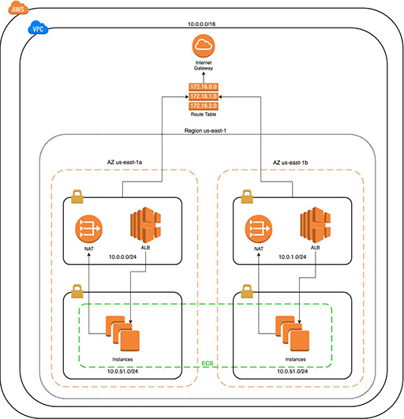

# IaaS AWS ECS Automated Provisioning with Terraform

## Script Overview: Diagrams

The following diagrams (Figures 1 – 5) are the architectural representations of the Terraform modules that automate the application infrastructure resource built in AWS.

[Figure 1. State Lock TerraForm Module]

[Figure 2. Global Terraform Module]

[Figure 3. Infrastructure Terraform Module]

[Figure 4. ECS Base Terraform Module]

[Figure 5. ECS Deploy Terraform Module]

## Pre-Requisites and  Permissions

The following are pre-requisites, including permissions, which are required to run the script:

Terraform installed on deployment machine—version ^0.14.7

AWS CLI installed on deployment machine –version ^2.0.58

AWS account with PowerUserAccess (or higher) policy assigned to user or machine

## Setup, Installation, and Configuration

MVP 8 is Terraform code grouped into three modules with the purpose of automatically creating a secure, highly available application-hosting infrastructure on the AWS ECS platform. Module 1 is the instantiation of state management for Modules 1, 2, and 3. Module 2 is the creation of global resources that can be used across multiple deployments of Module 3—this includes resources roles and a single bucket to house all log files for retention. Module 3 is the application infrastructure module. Module 3 is broken down into three sub-modules: infrastructure creation, ECS base resources, and ECS deployment resources.

### Step 1. Requirements

Deployment engineer must have AWS CLI and Terraform installed on development machine. Additionally, deployment engineer must have AWS access with, at least, PowerUserAccess role assigned to engineer or machine.

**At this time, all resources must be created in the us-east-1 region. And the Terraform code is configured with this assumption.**

### Step 2. Initial State Instantiation

MVP 8 Terraform code is divided into three modules. ‘state_lock_init’, ‘global’, and ‘dev’. To begin the creation of ECS infrastructure, a developer will begin with module 1 ‘state_lock_init’.

Terraform state files are how Terraform tracks the state of created resources, as well as locking creation/deletion/edition of resources to one interaction at a time which blocks multiple developers from creating conflicts in resources and state. Therefore, it is crucial to instantiate state locking properly when MVP 8 is first installed on a clean AWS environment.

The ‘state_lock_init’ module creates two resources, an S3 bucket for storing state files and a DynamoDB table for maintaining state location data. These resources will be used for remote state management for the individual modules that compromise MVP 8. **When running MVP 8 code on a clean AWS environment there will be no state management resources available, and the developer will have to create the initial ‘state_lock_init’ module resources with local state management. Then state management will be converted to remote state management using the resources created from the ‘state_lock_init’ module.**

**STATE_LOCK_INIT Module**

To instantiate remote state management resources with local state and then convert to remote state do the following steps:

1. Open state_lock.tf file in state_lock_init directory and change bucket property to the aws_s3_bucket.terraform_state resource. **Bucket names must be globally unique.**

    resource "aws_s3_bucket" "terraform_state" {
        bucket = "<bucket-name>"
    
        # Prevent accidental deletion of this S3 bucket
        lifecycle {
            prevent_destroy = false
        }
        
        # Enable versioning so we can see the full revision history of our
        # state files
        versioning {
            enabled = true
        }
        
        # Enable server-side encryption by default
        server_side_encryption_configuration {
            rule {
                apply_server_side_encryption_by_default {
                 sse_algorithm = "AES256"
                }
            }
        }
    }

2.  Change name property of aws_dynamodb_table.terraform_locks resource.

    resource "aws_dynamodb_table" "terraform_locks" {
        name         = "<dynamodb-table-name>"
        billing_mode = "PAY_PER_REQUEST"
        hash_key     = "LockID"
        
        attribute {
            name = "LockID"
            type = "S"
        }
    }

3. In the terraform backend “s3” configuration in the state_lock.tf file add the bucket name that was defined in the aws_s3_bucket.terraform_state resource to the ‘bucket’ value in the “s3” configuration and add the aws_dynamodb_table.terraform_locks name value to the ‘dynamodb_table’ value in the “s3” configuration.

    terraform {
        backend "s3" {
            bucket         = "<bucket-name>"
            key            = "state-lock/terraform.tfstate"
            region         = "us-east-1"
            
                dynamodb_table = "<dynamodb-table-name>" 
                encrypt        = true 
        }
    }

4. After you have added name and bucket value to terraform backend configuration, comment out the terraform backend configuration block of code. *This is necessary to instantiate resources initially with local state management.*

    //terraform {
    //  backend "s3" {
    //    bucket         = “<bucket-name>”
    //    key            = "state-lock/terraform.tfstate"
    //    region         = "us-east-1"
    //
    //    dynamodb_table = "<dynamodb-table-name>"
    //    encrypt        = true
    //  }
    //}

5. Once these changes have been made, navigate to state_lock_init directory in terminal and run the following commands:
   

    Terraform get
    Terraform init
    Terraform apply
  - terraform will want to add 2 resources. Enter a value: yes

6. After Terraform has successfully created the 2 state management resources, navigate back into the state_lock.tf file in the state_lock_init directory and uncomment the terraform backend configuration.

7. In terminal, run the following commands:

    Terraform init

- With the new backend configuration uncommented, you should see the following message when you run terraform init:

    - Initializing the backend...

    - Do you want to copy existing state to the new backend?
    Pre-existing state was found while migrating the previous "local" backend to the
    newly configured "s3" backend. No existing state was found in the newly
    configured "s3" backend. Do you want to copy this state to the new "s3"
    backend? Enter "yes" to copy and "no" to start with an empty state.
      
- When prompted to enter a value, enter ‘yes’. You should then see this message from Terraform:

    - Successfully configured the backend "s3"! Terraform will automatically use this backend unless the backend configuration changes.

8. In the state_lock_init directory, delete the local terraform.tfstate file.

At this point remote state management has been instantiated for MVP 8 ECS. **Please note the bucket name and dynamodb table name created, as these will be used across state management for the other modules.**

## Step 3. Global Resources Instantiation

After state management has been instantiated with the state_lock_init module, the next step for MVP 8 is creating global resources with the global module which will be used across all following application infrastructures created in the AWS account. When the global module has been run, the following resources will be created (see Figure 2 of section 3.1):

1. S3 bucket for CloudTrail logs

2. Roles and profiles for necessary AWS permissions for ECS resources created later, including:

- ECS Instance role

- ECS Instance profile

- CloudTrail role

- ECS Task execution role

- ECS Task role

- ALB role

**GLOBAL Module**

To instantiate global resources, do the following steps:

1. Navigate to global_state_lock.tf file in global directory and ensure that the bucket value and dynamodb_table value match the resources that were created from the state_lock_init module in the terraform backend configuration block.

        terraform {
            backend "s3" {
                bucket         = "<same-bucket-name-configured-in-state-lock>"
                key            = "global/terraform.tfstate"
                region         = "us-east-1"
                
                dynamodb_table = "<same-table-name-configured-in-state-lock" 
                encrypt        = true 
            }
        }

2. Once these changes have been made, navigate to global directory in terminal and run the following commands:

        Terraform get

        Terraform init
   — you should see ‘Successfully configured the backend "s3"! Terraform will automatically use this backend unless the backend configuration changes.’ Terraform output

        Terraform apply
   —Terraform will want to add 16 resources. Enter a value: yes

At this point all global resources has been instantiated for MVP 8 ECS. **Please note that the global module and init_state_lock module should only be run once per AWS account. Once the resources for these modules have been created, they will be used across all following application infrastructures created in AWS account.**

## Running the Script: Infrastructure Provisioning

Once the ‘state_lock_init’ and ‘global’ modules have been run, it is now time to create application infrastructure resources with the ‘dev’ module. The dev module is divided into three submodules which will be ran independently to create infrastructure resources. The three submodules are:

Infrastructure (see Figure 3A of section 1)

Ecs_base (see Figure 3B of section 1)

Ecs_deploy (see Figure 3C of section 1)

### Step 1. Infrastructure Submodule

1. Navigate to dev_infra_state_lock.tf file in dev/infrastructure directory and ensure that the bucket value and dynamodb_table value match the resources that were created from the state_lock_init module in the terraform backend configuration block.

        terraform {
            backend "s3" {
            bucket         = "<same-bucket-name-configured-in-state-lock>"
            key            = "global/terraform.tfstate"
            region         = "us-east-1"
            
            dynamodb_table = "<same-table-name-configured-in-state-lock" 
            encrypt        = true 
            }
        }

2. Navigate to main.tfvars file and define an environment name, project name, and application name for your resources.

        # A name to describe the environment we're creating.
        environment = "<environment-name>"
        
        # a name for tagging the resources created
        project = "<project-name>"
        
        # a name for tagging the application resource
        application = "<application-name>"
        
        # The IP range to attribute to the virtual network.
        # The allowed block size is between a /16 (65,536 addresses) and /28 (16 addresses).
        vpc_cidr = "10.0.0.0/16"
        
        # The IP ranges to use for the public subnets in your VPC.
        # Must be within the IP range of your VPC.
        public_subnet_cidrs = ["10.0.0.0/24", "10.0.1.0/24"]
        
        # The IP ranges to use for the private subnets in your VPC.
        # Must be within the IP range of your VPC.
        private_subnet_cidrs = ["10.0.50.0/24", "10.0.51.0/24"]
        
        # The AWS availability zones to create subnets in.
        # For high-availability, we need at least two.
        availability_zones = ["us-east-1a", "us-east-1b"]

**Make sure to leave all other variables as they are defined in the main.tfvars file. This ensures proper networking for VPC creation in infrastructure module.**

**And, again, all resources must be created in us-east-1 AWS region.**

3. Once these changes have been made, navigate to dev/infrastructure directory in terminal and run the following commands:

        Terraform get

        Terraform init
    -you should see ‘Successfully configured the backend "s3"! Terraform will automatically use this backend unless the backend configuration changes.’ Terraform output

        Terraform apply -input=false -var-file=main.tfvars

    -Terraform will want to add 39 resources. Enter a value: yes

At this point, all infrastructure resources have been instantiated for MVP 8 ECS (see figure 3A of section 1). These resources include:

- An AWS VPC with all relevant resources (see below architectural illustration).

[Figure 6. AWS VPC Architecture]

- An AWS CloudTrail for account/application auditing that is sent to AWS CloudWatch logs and is stored indefinitely in an S3 bucket.

- And AWS Security Groups that will be used with ALB, EC2, EFS, and ECS resources that will be created in later submodules.

### Step 2. ecs_base Submodule

1. Navigate to dev_base_state_lock.tf file in dev/ecs_base directory and ensure that the bucket value and dynamodb_table value match the resources that were created from the state_lock_init module in the terraform backend configuration block.

        terraform {
            backend "s3" {
                bucket         = "<same-bucket-name-configured-in-state-lock>"
                key            = "global/terraform.tfstate"
                region         = "us-east-1"
                
                dynamodb_table = "<same-table-name-configured-in-state-lock" 
                encrypt        = true 
            }
        }

2. Navigate to main.tfvars file and define a cluster name for the ECS cluster to be created. Additionally, change max, min, desired capacity, and instance type for autoscaling group (recommend leaving as defaults). Domain_name variable is for dns registration with Route53 and is outside the scope of this MVP.

        #ecs cluster name
        cluster = "<cluster-name>”
        
        #domain name for Route53 registration
        domain_name = "only1.click"
        
        # maximum number of ec2 instances for austoscaling group
        max_size = 1
        
        # minimum number of ec2 instances for austoscaling group
        min_size = 1
        
        # desired number of ec2 instances for austoscaling group
        desired_capacity = 1
        
        # instance type of EC2 for autoscaling group
        instance_type = "t2.large"
        
        # E2 ami definition - leave as empty string if latest linux ami is desired
        ecs_aws_ami = ""

**And, again, all resources must be created in us-east-1 AWS region.**

3. Once these changes have been made, navigate to dev/ecs_base directory in terminal and run the following commands:  

        Terraform get

        Terraform init
- you should see ‘Successfully configured the backend "s3"! Terraform will automatically use this backend unless the backend configuration changes.’  
    
    
        Terraform apply -input=false -var-file=main.tfvars

- terraform will want to add 21 resources. Enter a value: yes
   

At this point, all ecs_base resources has been instantiated for MVP 8 ECS (see figure 3B of section 3.1). These resources include:

- ECS EC2 instances from launch configuration and autoscaling group

- Application Load Balancer with listener and target group

- EFS file systems for file sharing across containerized applications with mount targets and access point definitions

- An ECS cluster for later ECS service and task resources

### Step 3. ecs_deploy Submodule

*A note about ecs_deploy submodule before running ecs_deploy submodule:*

*The ecs_deploy module is designed under the assumption that a containerized application has already been deployed to the AWS ECR repository and has been tagged appropriately. In order to define what ECR repository image is to be pulled to run on the ECS infrastructure, navigate to the data.tf file in the dev/ecs_deploy directory and examine/change the following code: In the data “template_file” “taskDef” code block, a developer will need to define the aws_ecr_repository value and the tag value for the relevant ECR image. This data block is used to define the container that is ran with the ECS task. This is the only place in the MVP 8 code where you will need to define your ECR image.*

    data "template_file" "taskDef" {
        template = file("${path.module}/templates/task-definition.json.tpl")
        vars = {
            aws_ecr_repository = <url-of-ecr-repo>
            tag                = <ecr-image-tag>
            project            = data.aws_vpc.vpc.tags.Project
            cluster_arn        = data.aws_ecs_cluster.cluster.arn
            instance_sg        = data.aws_security_group.instance_sg.id
            instance_subnet    = data.aws_instance.jenkins_instance.subnet_id
            scm_username       = data.scm_username
            scm_pwd            = data.scm_pwd
            environment        = data.aws_vpc.vpc.tags.Environment
            name               = data.aws_vpc.vpc.tags.Project
        }
    }

*Instantiating ecs_deploy Resources*

1. Navigate to dev_deploy_state_lock.tf file in dev/ecs_deploy directory and ensure that the bucket value and dynamodb_table value match the resources that were created from the state_lock_init module in the terraform backend configuration block.

        terraform {
            backend "s3" {
                bucket         = "<same-bucket-name-configured-in-state-lock>"
                key            = "global/terraform.tfstate"
                region         = "us-east-1"
                
                dynamodb_table = "<same-table-name-configured-in-state-lock" 
                encrypt        = true 
            }
        }

2. Navigate to main.tfvars file and define a desired_tasks integer (recommend leaving as default).

    # number of desired tasks to be running in the ecs cluster
    desired_tasks = 1

**And, again, all resources must be created in us-east-1 AWS region.**

3. Once these changes have been made, navigate to dev/ecs_deploy directory in terminal and run the following commands:  

    Terraform get

    Terraform init 
– you should see ‘Successfully configured the backend "s3"! Terraform will automatically use this backend unless the backend configuration changes.’ Terraform output

    Terraform apply -input=false -var-file=main.tfvars

- Terraform will want to add 3 resources. Enter a value: yes

At this point, all ecs_deploy resources has been instantiated for MVP 8 ECS (see figure 3C of section 1). These resources include:

- ECS Service

- ECS Task

- Route53 record for HTTPS routing 